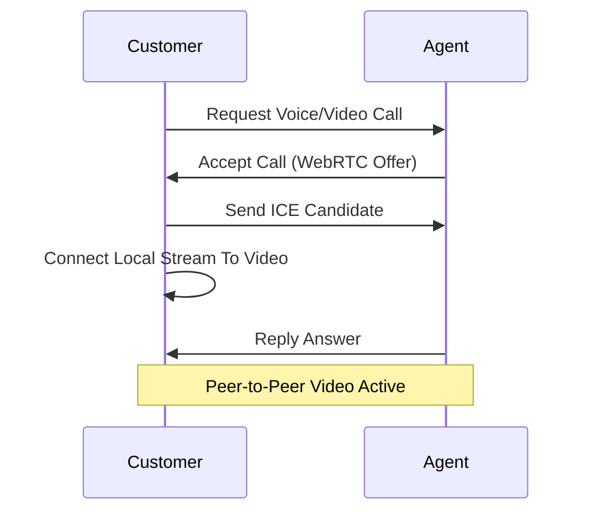

# Frontend Insurance Application - Ultimate Developer Guide & Technical Documentation

## Table of Contents
1. [Introduction](#1-introduction)
2. [Unique Selling Propositions (USPs) & Innovations](#2-unique-selling-propositions-usps--innovations)
3. [Technology Stack](#3-technology-stack)
4. [Architecture & Folder Structure](#4-architecture--folder-structure)
5. [Core Services Deep Dive](#5-core-services-deep-dive)
6. [Component Library & Use Cases](#6-component-library--use-cases)
7. [Pages & Application Flow](#7-pages--application-flow)
8. [Real-Time Communications (WebRTC & SignalR)](#8-real-time-communications-webrtc--signalr)
9. [Forms, Validation, & CRUD Operations](#9-forms-validation--crud-operations)
10. [Build & Deployment Instructions](#10-build--deployment-instructions)
11. [Performance Optimization](#11-performance-optimization)

---

## 1. Introduction
The **AcciSure Frontend** platform is an enterprise-grade Single Page Application (SPA) designed to overhaul the traditional insurance lifecycle. Built with Angular 21, the application provides an intelligent, fast, and human-centric ecosystem where users can seamlessly discover policies, initiate claims, and receive real-time support. It serves multiple user personas—from public Customers to internal Admin logic.

---

## 2. Unique Selling Propositions (USPs) & Innovations
The AcciSure platform differentiates itself by migrating past "simple CRUD" apps into a truly intelligent system. Here are the core USPs implemented on the frontend:

### 2.1. AI Policy Chatbot via N8N
Traditional FAQ pages are static and unengaging. The AcciSure frontend integrates an interactive, contextual AI chatbot right on the policy browsing pages. 
- **Implementation:** Built as a standalone `ChatbotComponent` that interfaces with the N8N backend orchestration.
- **UX:** Uses floating chat widgets that remain on screen even during route transitions.

### 2.2. AI Claims Intelligence (AI Summarize) & Document Verification
Instead of humans manually browsing endless PDF pages, the frontend provides an interface connecting to an AI Summarizer.
- **Implementation:** Claim Officer Dashboards render AI-generated summaries, risk scores, and payout ranges directly alongside uploaded claim attachments.

### 2.3. In-Platform Video Calling (WebRTC)
Eliminates third-party tool dependencies (like Zoom/Meet) for customer verification and agent consultations.
- **Implementation:** Peer-to-peer visual communication embedded within the `agent-dashboard` and `customer-dashboard`, relying purely on browser-native WebRTC standards and STUN/TURN servers.

### 2.4. Real-Time WhatsApp-Style Chat (SignalR)
Customers can text their designated agent seamlessly via a rich-text UI.
- **Implementation:** Angular SignalR client bindings ensure instant, bidirectional data flow without HTTP polling.

### 2.5. Cloud Document Storage CDN
- **Implementation:** Using ImageKit (a purpose-built media CDN) for instantaneous document upload and globally cached delivery, massively increasing UX performance over raw file drops.

### 2.6. AI Voice Call Assistant & Multilingual Support (Upcoming)
Features on the roadmap include Web Speech API interactions enabling vernacular language speakers to interact purely through voice commands on the frontend.

---

## 3. Technology Stack
- **Framework:** Angular 21 (Modular, strictly-typed front-end framework)
- **Styling:** Tailwind CSS 4.0, PostCSS (Utility-first rapid prototyping and design system)
- **State Management:** RxJS 7.8 (Reactive streams for state and HTTP)
- **Real-Time Client:** `@microsoft/signalr` (For chat and notifications)
- **Data Visualization & Export:** `chart.js` (Dashboards), `jspdf` & `jspdf-autotable` (Invoice and policy exports)
- **Local Machine Learning / OCR:** `tesseract.js` (For client-side scanning verification)
- **Unit Testing:** Karma & Jasmine

---

## 4. Architecture & Folder Structure
```text
c:\Sanjay\frontend-insurance\
├── src/
│   ├── app/
│   │   ├── components/       # Dumb and smart shared components
│   │   │   ├── chatbot/      # N8N powered AI assistant widget
│   │   │   ├── incident-location/ # Mapbox / Leaflet map picker
│   │   │   ├── notification-panel/ # Realtime slide-out panel
│   │   ├── interceptors/     # Global HTTP Interceptors
│   │   ├── pages/            # Routable container components
│   │   │   ├── auth/         # Login, Register
│   │   │   ├── dashboard/    # Admin, Agent, Customer, ClaimOfficer profiles
│   │   │   ├── details/      # Policy rendering and Claim submission
│   │   ├── services/         # API business logic layers
│   │   │   ├── auth.service.ts
│   │   │   ├── claim.service.ts
│   │   │   └── chat.service.ts
│   │   ├── app.routes.ts     # Main application routing tree
│   │   ├── app.config.ts     # Global providers and bootstrapping
```

---

## 5. Core Services Deep Dive
The `/services` directory abstracts HTTP capabilities. These handlers implement standard CRUD (Create, Read, Update, Delete) along with complex USP flows.

### 5.1. AuthService (`auth.service.ts`)
- **`login(credentials: LoginDto)`**: Dispatches POST to `/API/Auth/Login`. Returns JWT and roles.
- **`register(data: RegisterCustomerDto)`**: Standard CRUD implementation. Uses Dual-Gate Registration (OTP + CAPTCHA) in the component layer before calling this method.
- **`logout()`**: Clears LocalStorage JWT and terminates SignalR connections.

### 5.2. ClaimService (`claim.service.ts`)
- **`raiseClaim(request: RaiseClaimRequest)`**: Initiates the claim workflow.
- **`getClaims(statusFilter?: string)`**: Executes GET against endpoints yielding arrays of `InsuranceClaim` types.
- **`evaluateWithAI(claimId: number)`**: Fires an N8N webhook trigger to process the `ClaimDocument` files through an LLM and returns the summarized text.

### 5.3. ChatService & NotificationService (`chat.service.ts`)
- Utilizes `@microsoft/signalr` HubConnectionBuilder.
- **`startConnection()`**: Connects via Bearer token to WS endpoint.
- **`sendMessage(user: string, message: string)`**: Emits `SendMessage` to the backend hub for dynamic WhatsApp-style communications.

### 5.4. AdminService & PolicyService (`admin.service.ts`)
- **`createPolicy(policy: PolicyConfiguration)`**: Standard Admin CRUD for creating a new offering.
- **`updatePolicy()`**, **`deletePolicy()`**: Administrative mutators.
- **`getDashboardStats()`**: Fetches aggregates to populate Chart.js canvases (e.g., Load Metrics, Revenue).

---

## 6. Component Library & Use Cases
### 6.1. Incident Location Picker
When filing a claim, users interact with the `IncidentLocationComponent`. This utilizes the Geolocation API to gather exact Coordinates, solving the industry problem of vague location strings.

### 6.2. Document Uploader Grid
Utilizes ImageKit libraries. Provides drag-and-drop zones, file size validation (max 5MB), format checks (PDF/JPG), and upload progress bars before ever hitting the `PolicyDocumentsRequest` API.

### 6.3. WebRTC Video Caller
An encapsulated component containing `<video>` elements for local and remote streams. It handles STUN resolution, ICE candidate generation, and connection states to present a pristine video consultation window for agents.

---

## 7. Pages & Application Flow

### 7.1. Landing & Marketing Pages
The root of the frontend tree (`/landing`). Highly stylized presentation of policies, leveraging Tailwind's responsive grids, animations, and typography designed for mobile-first views.

### 7.2. User Portals (Dashboards)
The Angular router protects access to each portal utilizing `RoleGuard` interceptors:
- **Admin Dashboard:** Displays load balancing charts, revenue projections.
- **Agent Dashboard:** Contains a CRM table (Client CRUD), policy issuance buttons.
- **Customer Dashboard:** Lists Active Policies, coverage balances (Real-Time Auto-Deduction), and past claims.

### 7.3. Claim Generation Form Flow
A multi-step reactive form (Wizard):
1. Select Policy.
2. Fill Incident Details (Date, Type, Location).
3. Upload medical/FIR documents.
4. Review & Sign.

---

## 8. Real-Time Communications (WebRTC & SignalR)
We engineered a zero-polling environment.
### 8.1. Video Conference Flow

This requires complex component teardown logic within `ngOnDestroy` to stop media tracks from keeping webcams active.

---

## 9. Forms, Validation, & CRUD Operations
### 9.1. Reactive Forms Architecture
Angular's `FormBuilder` strictly regulates data entries.
- **Registration Form:** Validates Regex for password strength. Incorporates CAPTCHA tokens prior to the `AuthService.register()` method.
- **Raise Claim Request:** Marks fields (e.g. `IncidentDate`) as heavily validated (`Validators.required`, custom date-in-past validators).

### 9.2. General CRUD Mappings
Throughout the frontend, data flows in standard patterns: Component `<->` Service `<->` Http Client. List views populate HTML tables with `*ngFor`, Detail views use strict IDs (`/policy/123`), and Mutators emit HTTP PUTs returning fresh states.

---

## 10. Build & Deployment Instructions
### 10.1. Local Run
```bash
npm ci
ng serve --open
```
### 10.2. Production Build Setup
```bash
ng build --configuration production
```
Produces an optimized AOT compiled artifact within the `/dist` directory. The project has a `vercel.json` meaning it natively supports instant Vercel Serverless deployments. Just run `npx vercel`.

---

## 11. Performance Optimization
- **Lazy Loading:** All dashboards are lazy-loaded via `loadChildren()` routes to keep the initial JavaScript bundle small.
- **PostCSS Minification:** Tailwind automatically purges the thousands of unused CSS classes before bundling.
- **OnPush Change Detection:** Critical view components utilize `ChangeDetectionStrategy.OnPush` to prevent Angular from exhaustively traversing the component tree on every tick.

---
*Generated by AI Engineering Assistant for ATTELLI SANJAY KUMAR*
